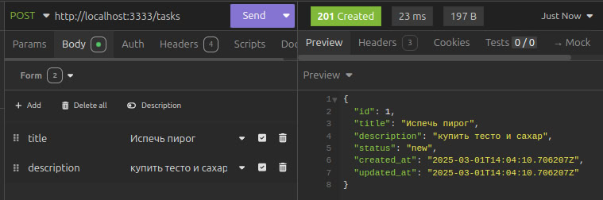
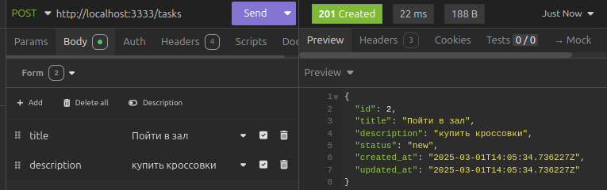
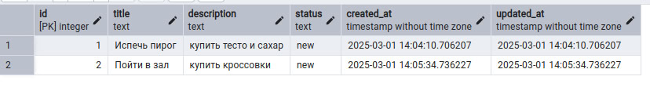
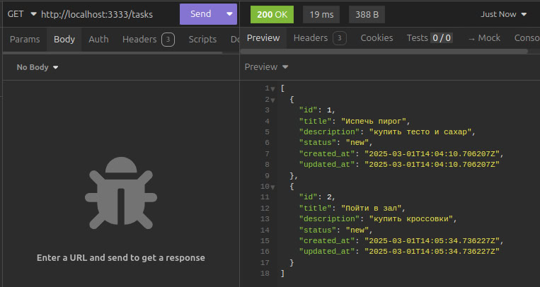
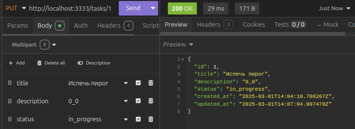
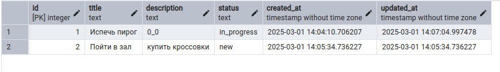
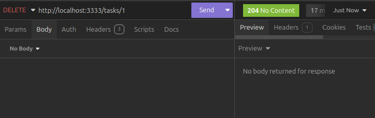
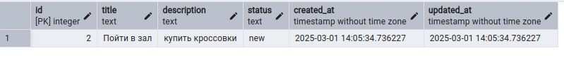

# Task Management API

## Запуск проекта

### 1. Подготовка конфигурации
Скопируйте файл конфигурации и переименуйте его:
```sh
mv example.env .env
```

### 2. Запуск Docker-контейнеров
Используйте команду для сборки и запуска контейнеров с переменными окружения:
```sh
docker compose up --build
```

### 3. Миграции базы данных

#### 3.1 Установите `golang-migrate`
Установите инструмент для миграции базы данных, следуя инструкциям из официального репозитория:
[golang-migrate](https://github.com/golang-migrate/migrate)

#### 3.2 Примените миграции
Запустите команду для применения миграций:
```sh
make migrate_up
```

После успешного выполнения этих шагов API будет готово к использованию.


---
## Скриншоты




---

---


---

